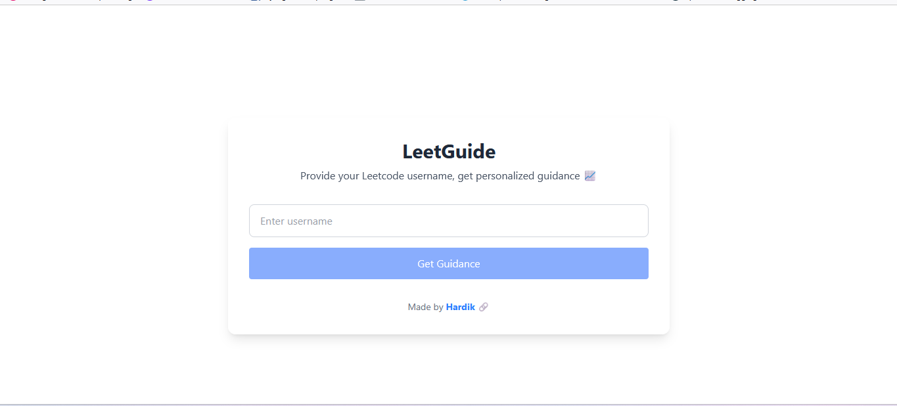

# 🧠 LeetGuide Frontend — Because Solving 500 Easy Problems Still Doesn't Make You Good at DP 😅

> 👀 Looking for the backend? Head over to 👉 [LeetGuide Backend Repo](https://github.com/imHardik1606/leetguide-backend)  
> 🌐 Live Demo: [leetguide.vercel.app](https://leetguide-xi.vercel.app/)

---

Welcome to the **Frontend** of **LeetGuide** — your no-filter AI mentor for LeetCode progress, brutally honest and powered by Gemini.

---

## 💻 What This Does

- Fetches your LeetCode profile data via backend APIs  
- Renders Gemini-powered advice (yes, it roasts you too)  
- Clean, fast, and responsive UI using React & Tailwind  
- Shows topic-wise stats, smart tips, and real-time feedback  

---

## 🧑‍💻 Tech Stack

| Layer         | Tools Used           |
|---------------|----------------------|
| 🎨 UI         | React, Tailwind CSS  |
| 📡 API Comm   | Axios                |
| 🔐 Auth (opt) | JWT (Planned)        |

---

## 🛠️ Local Setup

Clone the repo:

    git clone https://github.com/imHardik1606/leetguide-frontend.git
    cd leetguide-frontend

Install dependencies:

    npm install

Create a `.env` file:

    VITE_API_URL=backend.port

Start the dev server:

    npm run dev

---

## 🖼️ Preview

  
> Minimal, clean, judgmental. Just like your mentor should be.

---

## 🧪 Sample Use

1. Enter your LeetCode username  
2. Click “Get Guidance”  
3. Cry softly as Gemini tells you:  
   - “You're allergic to Binary Trees.”  
   - “You solved 92 Easy but only 3 Medium. Do better.”  
   - “Contest rating? Is that a myth for you?”

---

## 🔗 Backend API

The frontend talks to this backend:  
👉 [LeetGuide Backend](https://github.com/imHardik1606/leetguide-backend)  
🌐 Live API: [leetguide-api.onrender.com](https://leetguide-api.onrender.com)

---

## 🤝 Contribute

Pull requests and PR roastings welcome.  
- Fork it  
- Create a branch  
- Improve it (or destroy it)  
- Submit a PR

---

## 📄 License

MIT. Use it, fork it, meme it — just don’t sell it as “DSA Prep Pro+ Ultra Max” for ₹499 on Instagram.

---

## 👨‍💻 Built by

**[Hardik Gayner](https://github.com/imHardik1606)** — Debugged with 💻, ☕, and Gemini sass.
